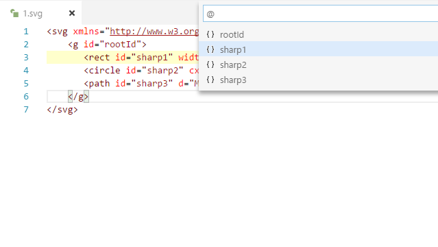
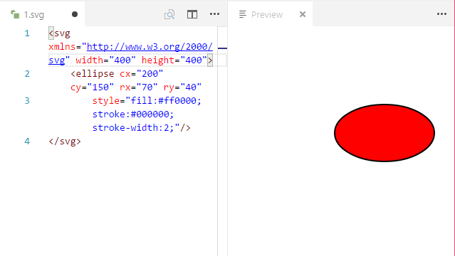

# svg

提供强大的 SVG 语言支持扩展(beta)。

## Features

SVG 元素自动完成。

SVG 属性自动完成。

带有 id 属性的 SVG 元素可以作为文档符号来快速定位。

SVG 预览。

> 提示: 所有自动完成选项是上下文关联的，不会总是显示所有项目。

## 已知问题

配置选项功能还未实现。

## 更新历史

### 0.0.2

* 改进预览。
* 改进符号显示方式为 `[tag]#[id]` 并修正一个 BUG。

### 0.0.1

首次发布

-----------------------------------------------------------------------------------------------------------
## 更多信息

* [MDN SVG 参考](https://developer.mozilla.org/en-US/docs/Web/SVG)

**Enjoy!**